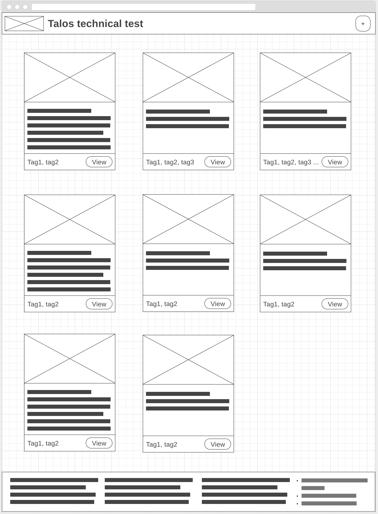
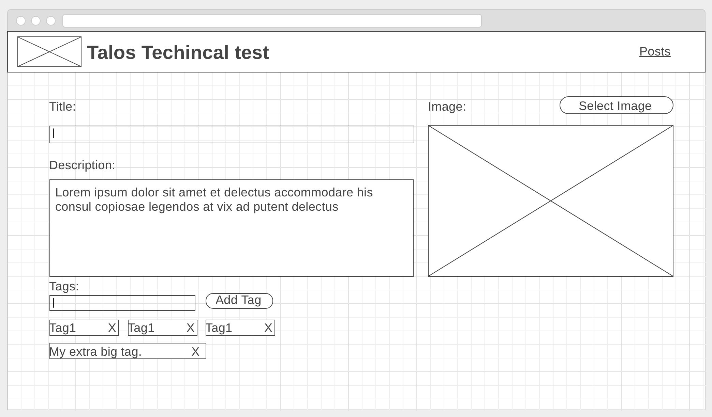
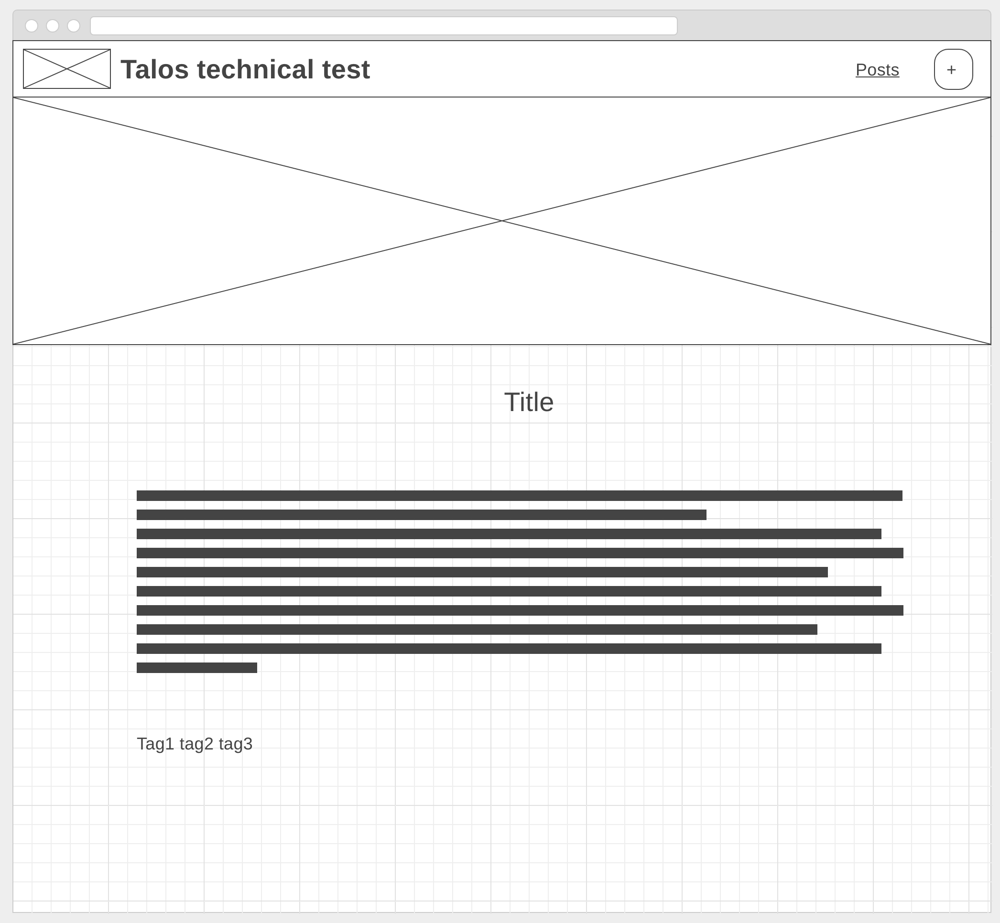

[](https://deploy.now.sh/?repo=https://github.com/zeit/next.js/tree/master/examples/with-jest)

# Test with jest

This repository contains a example about tests React  and redux whit jest

The api and the server have two README separately

## quick start for visual studio code

You can run visual task: 
1. "install dependencies"
2. "run project"

More info about run task in https://go.microsoft.com/fwlink/?LinkId=733558

## Requirements

The company has a new project: an app to manage posts. Some weeks ago a back-end developer created the needed api to fulfil all clients requirements. The front end team must use that [api](#api-server) and create the front-end for the application. 

Users that enter this app should be able to:

1. __View a list of all existing posts:__
    With in this view there should be a list of cards, each of this card must display an image of the post, the title and the description (representing the post itself), the post tags and a view button that will take the user to the post view. [e.g](#main-screen)

2. __Create a new post:__
    This view should have a form which allows the user to creat a post. A post is made of a title, description, tags and an image. The client specified that the post can have more than one tag and that any word (or phrase) a user enter might be a tag.
    When the user is done creating the post, the app should display a success mesage and redirect the user to the new post datail page or to the list of posts.  [e.g](#add-screen)

3. __Post details:__
    This view displays the full post (image, title, description, and tags). The user should be able to enter the post directly if some one else give him the link to it  [e.g](#view-screen)

4. __Header:__
    The header should be present on all pages and should have: the logo of the company (provided in the assets folder), the title of the project, a link to the list of posts and a button with a plus sign that should redirect to the create new post page, however this button have some special functionality:
a. When the user hovers over it, the content should switch to "Add new post".
b. When the user is in the create new post view, it should not be present.

5. __Footer:__
    The fotter must be present in all pages however the client is not sure what is going to be there so he told us to mock a couple of paragraphs after each other as shown in the [main screen](#main-screen). Also he asked us that if the content in the application is too short the footer should remain in the bottom of the screen (sticky footer).

## Deliverables

The client spects incremental functional deliverables, we agreed to do the following:

1. __Requirement 1 and 4__
2. __Requirement 2.__
3. __Animations:__

    There are a couple of animations the client wants to see.
One is the button in the header the transition between the "+" and "Add new post" shoud be smooth. Also, he wants a sort of zoom in the images of the post cards when you hover on them.

4. __Requirement 3.__
5. __Requirement 5.__

## Objective

In the given time you have to finish as many Deliverables as you can. They should be done in order, if you don't manage to complete one of those, the progress done on it will be taken into account. 

## Notes

The client ask for the app to look ok in different devices and sizes including phones.
You can add whatever library you want to. Do not reinvent the wheel.

## Api server

You will need to conect the app to an api no matter what your test is (Angular, React or Html, CSS and JS). This api is provided by the project inside `./api` folder, you can run it with  ```npm run server```. The B.E. is already populated with some post for you to do the first steps of the test. For more info please see the project readme (`./api/README.md`).

## Wireframes

The following wireframes are more a mean to ilustrate functionality than design. You can move things arround as long as is consistent and easy to use.

##### Main Screen:



##### Add Screen:



##### View Screen:

